# **GitHub Tutorial** by _Tony Lin_
---
## Git vs. GitHub
Git is used for taking snapshots of your code (Add -> Commit) and it doesn't require Github. It a local
repository. On the other hand Github requires Git, and it stores (by pushing) the code into the "clouds",
website (c9). It is a remote repository.

---
## Initial Setup
`git init`- Initialize git in your directory allowing you to add code to the staging area and commit
them. Used when coder start a new Git project.
1. `cd ~/workspace/`(directory name)
2. `git init`
3. Use `ls -a` to check if git init has been initalize in the correct directory.

---
## Repository Setup
1. Go to Github.com, *create a Github account if you dont already have one.*
[Here is the link](https://github.com/)  
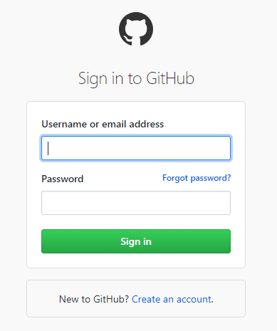
2. Click on your avatar on the top right corner.
3. Click `your repository`
4. Press `New`
5. Give your repository a name
6. Then press create repository
7. Now go to your ide website (c9), *create an account if you dont have one.* 
[Here is the link](https://c9.io/signup)
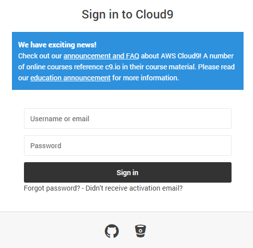
8. Create a repository by clicking on the `+` icon on the top right corner.
9. Set up a SSH key or use a http link (*look below for guide*).
10. Now go to your repository and cd into workspace `cd ~/workspace`.
11. Git clone that repository using the SSH link or https link.  
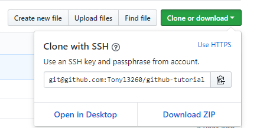
12. Now cd into that repository `cd (Name)` and then initalize `git init`  

Every new local (c9) needs a remote (github) to push work into. You can use a SSH key to help push files  
into your repository or HTML. SSH is a one time setup that links your account with Github while HTTP
reqiures you to log into your Github account everytime you want to push.

How to setup your **SSH** key:
1. Go to your ide website (c9) or [Skip step 2 and 3](https://c9.io/account/ssh)
2. Click on the gear icon on the top right corner.
2. Click **SSH keys**
3. Copy the SSH key on the top for public repository. Bottom SSH key for private repository.
4. Now go to Github [Link](https://github.com/)
5. Press on your avatar on top right corner.
6. Click **SSH and GPG keys** [Link](https://github.com/settings/keys)
7. Now press `New SSH key`
8. Paste the SSH key from c9 and click `add SSH key`

How to use **HTTPS**:
1. Go to your Github repository
2. Press `Clone or download`
3. Now you get your http link  
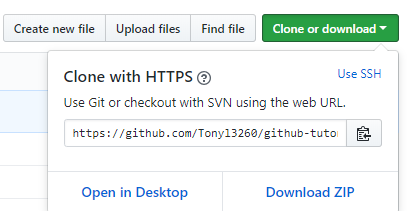

---
## Workflow & Commands
### How to push your code to Github:
#### Edit -> Add -> Commit -> Push 

1. Edit your code and file. Make sure it is saved, ⌘s.
2. Before you can add your code to the staging area, the directory must be intialized `git init`. To
add the code to the staging area you can use `git add .` or `git add filename`. You can check to see
if your code has been added to the staging area by using `git status`.  

3. To commit your file, your file must be first added to the staging area. You can commit your file
by using `git commit -m "msg"`. You can put a message when you commit to remind yourself what you just
committed.

4. To push your file the requirement above must be first fulfilled and connected to a git remote to be pushed
into by your local (c9). You can check to see what remote is connected to our directory by using `git remote -v`.
You can push your code by using `git push origin master`. However if you flag your remote the first time
by using `-u``git push -u origin master` you dont have to type `git push origin master` everytime you 
want to push. Instead you can use `git push`.  
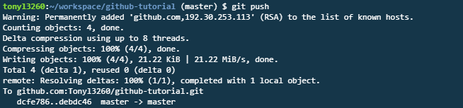

### What if `git push` **doesn't** push?
* Use `git push --force`    
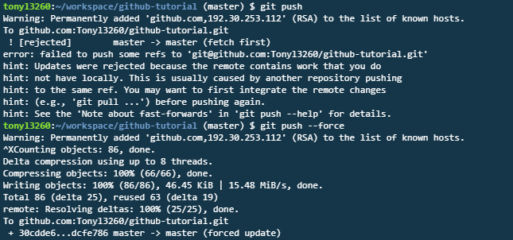

---
## Rolling Back Changes
`git checkout -- FILENAME`: Reset all changes made that are currently not staged (have'nt been `git add`).

`git reset HEAD FILENAME`: Removes a file from the staging area.

`number`- amount of commits to go back. Changing the number changes the amount of time you undo something.

`git reset --soft HEAD~1`: Undo the previous commit, keeping the files in the stating area and the changes
made previously.

`git reset HEAD~1`: Undo the previous commit, but **Remove** the files from the staging area while keeping 
the changes made previously.

`git reset --hard HEAD~1`: Undo the previous commit, but **Removes** both the file from the staging are and 
the changes made.

`git reset --hard SHA`: Undo to previous commit with the SHA from the beginning, all changes made after the
commit will be lost.

---
## Collabration
Github allows users to collaboration together on projects by forking and cloning each others work and giving
each other feedback or giving them improved code through pull request.  
`Clone`- Allows user to clone someone's work into their workspace, however you can not push to it.  
`Fork`- Allows user to make a copy of someone's remote repository so they can push to it.  
`Pull request`- Ask moderators for permission to merge your forked repository to their remote.  
`Git pull`- To pull your remote repository to your local, usually when your remote is ahead few commit.

### How to clone:
1. Go to someone's repository in Github and find something you want to clone
2. Now press on the the green `clone or download` button  
3. Get the SSH or Https link
4. Go to c9 and go to your workspace `cd ~/workspace`
5. Enter `git clone (link)`

### How to fork:
1. Go to Github and find a repository from a user you want to make a copy of
2. Click on the fork button on the top right corner.  
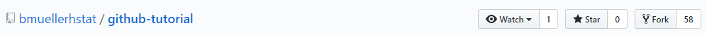
3. press on the the green `clone or download` button  
4. Get the SSH or Https link
5. Go to c9 and go to your workspace `cd ~/workspace`
6. Enter `git clone (link)`
7. Now you can work on your local and push your commits to your remote.

### How to ask for a pull request:
1. Go to someone's repository in Github
2. Click on `pull request`
3. Click `New pull request`
4. Then click `Create pull request`  
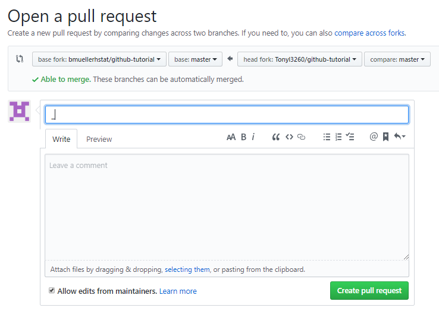
5. Your pull request now has to be merged/denied by the reviewers of the repository.

---
## Error Handling
### **When faced with an error**, try using `git status` to check for errors then google.  
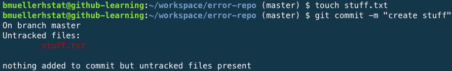 
#### Error: The programmer attempted to `git commit` the file before he added it to the staging area `git add`.
#### Solution: Before you commit a file, make sure you first add it to the staging area.  
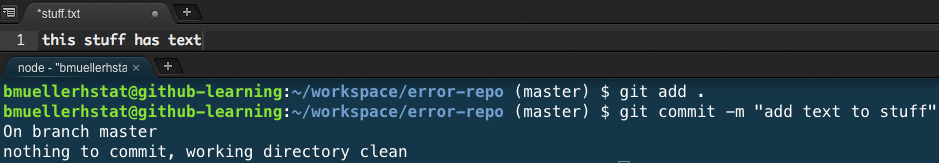  
#### Error: No edits were commited because edits weren't saved before they were added.  
#### Solution: After making an edit, make sure you save your file by using ⌘s.   
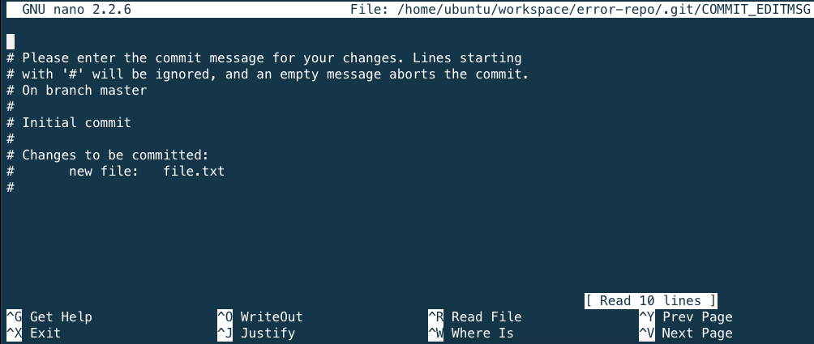  
#### Error: The programmer tried to commit the file without adding a message to it (flag the commit `-m`).  
#### Solution: Press control+x, and include the flag `-m` before commiting next time.  
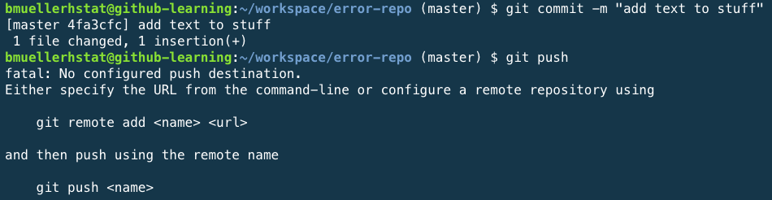   
#### Error: A remote repository hasn't been connected to your local yet.   
#### Solution: Connect the remote and the local by using your https or SSH link.  
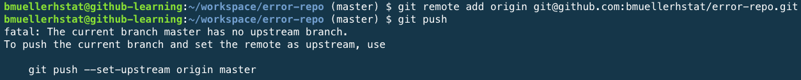  
#### Error: A upstream wasn't setup for the branch to know where to push git into.  
#### Solution: Git push using `git push origin master` for your first time.  
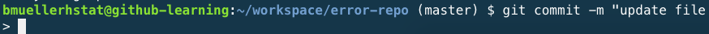  
#### Error: The programmer did not put a “ after update file.  
#### Solution: Finish the input or press control+c.  
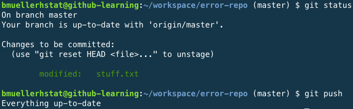  
#### Error: You can not push codes in the staging area without first commiting them.  
#### Solution:  `git commit -m` before pushing.  
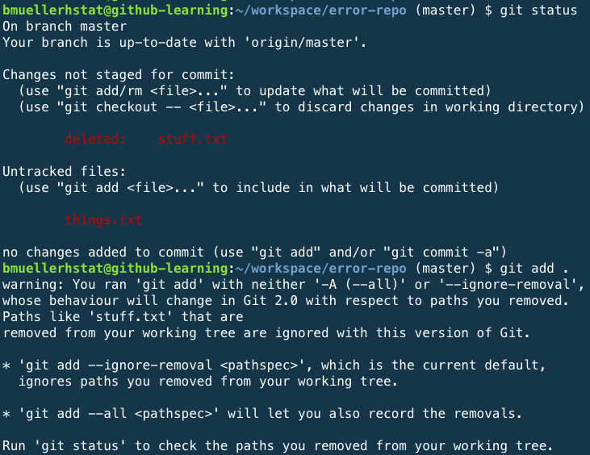  
#### Error: Stuff.txt is a deleted file, c9 does not know if they should add or not add the file.  
#### Solution: The programmer can use `git add --all` instead of `git add` to add deleted file to the staging area.  
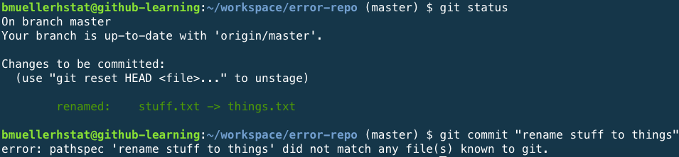  
#### Error: The programmer forgot to include `-m` while commiting.  
#### Solution: Use `git commit -m` when commiting.  
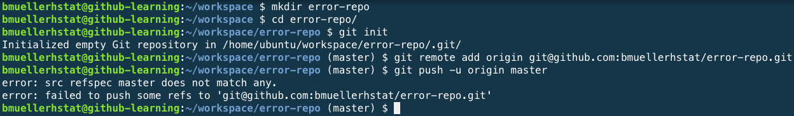  
#### Error: The programmer did not add any file and commit any changes before he tired to push.  
#### Solution: The programmer has to `git add` and `git commit` before he can push anything to the repository.    
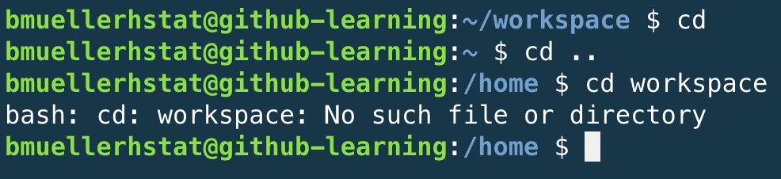  
#### Error: The programmer cd above `~` so he could not cd back into workspace.  
#### Solution: `cd ~/workspace`.  
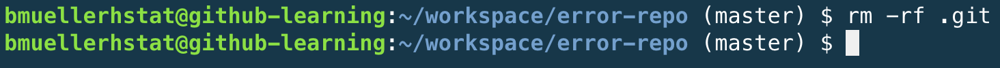  
#### Error: Git was initalized in the workspace.  
#### Solution: cd to workspace and enter `rm -rf .git` to remove git.  